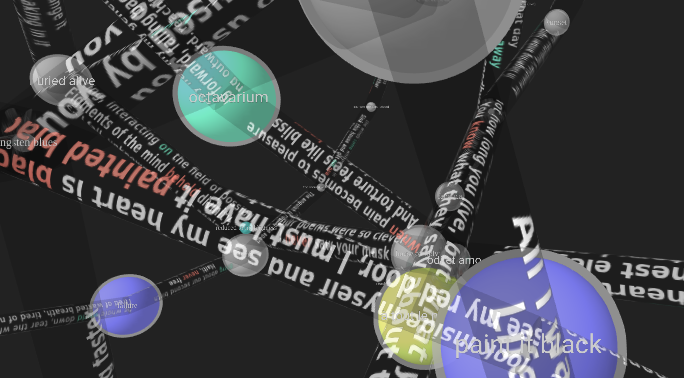

# Immersive Tracklist

Or, 'why does Pandora keep playing me these songs in clumps?'



`docs` hosts a [web version](https://jazztap.github.io/tracklist-knotviz/) of the application + my other class materials, excepting active research data. (I've put Project 2 on the Overleaf documenting it.)

Please reload if the nodes got jumbled on top of each other. Your browser will have cached the tracklist topology & be able to figure it out next time.

Built with A-Frame, Canvas, and:  
@vasuriano/aframe-forcegraph-component  
@ngokevin/aframe-orbit-controls (which interferes with the above's HUD, but lets you hold the space in your hands)  
@johnwmillr/LyricsGenius (super easy to use!)

## Navigation

Look away from edges to flip the order of splicing of three-line excerpts of the connected nodes' lyrics. Type search terms (alphabetical + spaces) to highlight nodes. Reset by hitting 'enter'.

(Actual scrolling animation would be desirable. That said, side-by-side lyrics comparison would be more robust as a widget.)

Tip: Phonemes are good searches, when their English orthography is stable. Flipping an edge will scroll its content to the first instance of the searched substring. There is no other mode of fuzzy select.

Oh, terms in red and cyan pertain roughly to time and space, respectively. They're coded up in `index.html`: lines `190-194`.


## Installation

To run the application locally, you must regenerate the `gen` dictionaries by running the notebook after populating `config`.

An example of `thumbprint.csv` (manually collected) is included. Separators '---' are not part of CSV semantics, but used to delimit generated playlists.

`config/transcriptions.txt` and `config/supplements.txt` are both of form

```
# title, artist
lyrics go here
spanning

arbitrary lines

# next title, artist
...
```
I arbitrarily distinguished between actual missing transcriptions (tip - look for lyrics that omit capitalization), and lyrics on Google but not Genius.

`config/token.txt` is of form
> genius access token  
> spotify client id  
> spotify client secret

which are respectively obtained from

https://genius.com/api-clients
https://developer.spotify.com/dashboard/

whose APIs are used to annotate nodes with duration + outgoing edges with lyrics.

(Spotify seems to have changed theirs again in the middle of development. I may as well let Tunebat deal with them.)
